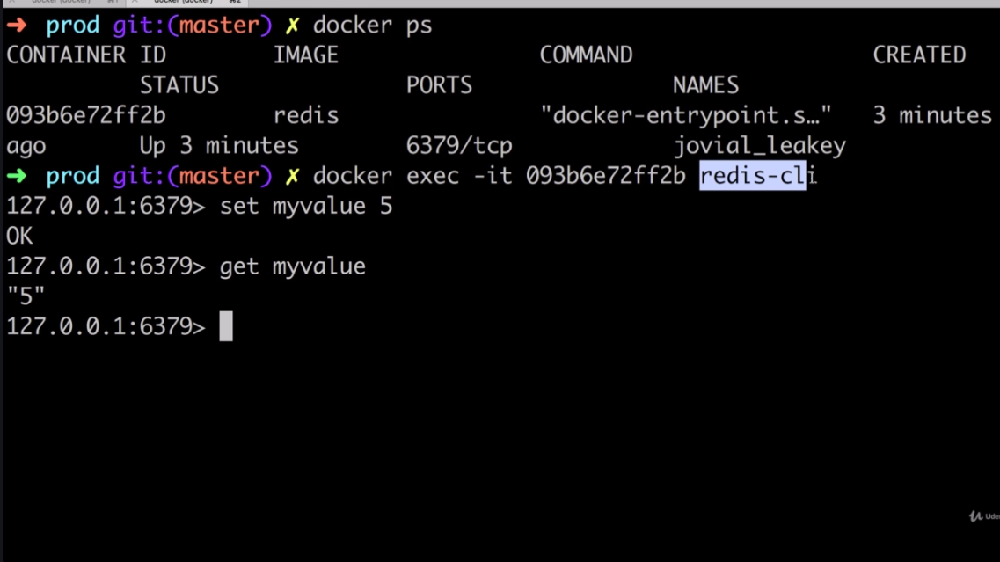
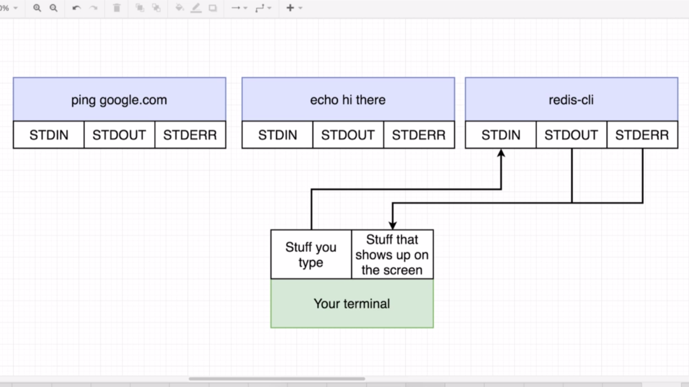

# Some Docker commands list

## Listing containers

- ### `docker ps`
  A command to list containers and getting some informations about them like... container_id, image name, status, ports, etc.

## Stopping containers

- ### `docker stop < container_id >`
  A command to stop the container giving a chance to the proccesses inside, a change to shut down.
- ### `docker kill < container_id >`
  Command to kill the container and all the inside proccesses without waiting.

## Running additional commands inside running containers

- ### `docker exec -it < container_id > < command >`

  Running a additional command inside a running container to have access to the container proccesses.

  **Example:**
  

    
  

   

  ## How `-it (-i -t) ` flag works?

  That flag allow us to provide input to the container
  

    
  

- ### `docker exec -it <container_id > sh`
  Running and getting a command prompt inside a container

## **Note**:

> Two running containers have absolutely completely separated FS and there's no sharing data between the two.
