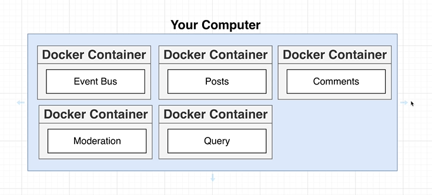
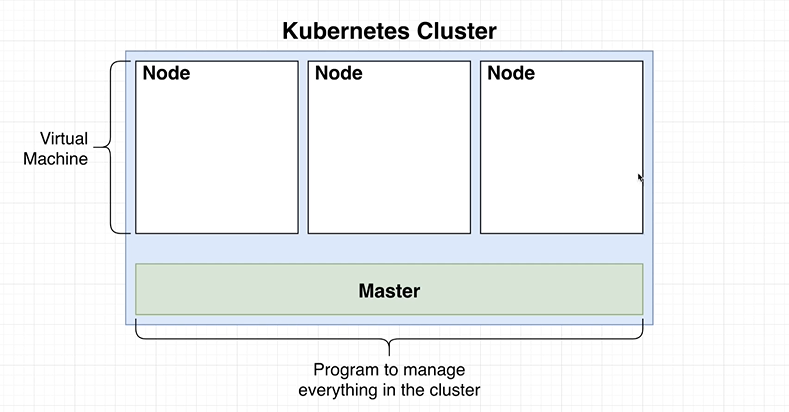
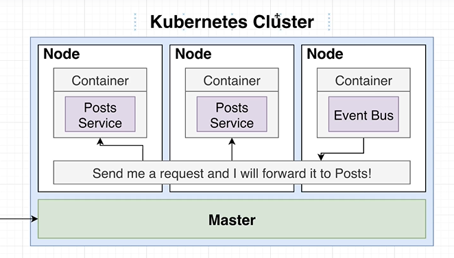

> *That note is just a resume about docker and kubernetes intro...*

## Why use Docker? 🐳

So, Docker is a plattaform where we can create, deploy and manage virtualized application containers running on a common OS, with Docker we can create that things called **containers**.

**But what is containers? 🤔**
Container is like an isolated computing environment, and it contains everything that is required to run one single program in one single instance.

Looking to the microservices architeture design, we're going to end up creating separate docker containers, and each of this containers will run each of our individual services independently.

**But why use Docker? 💭**
Running our application, makes big assumptions about our environment, and running our application requires precise knowledge of how to start each service (npm).

So, running our application, we're assuming that the basic initial command to run the app on development environment is ```npm start```, but to execute the following command, we're assuming that npm is installed on our local machine, so just to run our program we are making those really big assumptions we're saying npm and node are installed on our local machine.

<center>
  
</center>

**The whole gold of Docker**🥇... is to remove those issues, by creating container where we are going to wrap up all the dependencies that some program requires. That means we're going to wrap up NPM and Node environment into this little isolated virtualized computing environment, wrapping all the dependencies into the **container** of our service. We're also going to include on our container some information and instructions about how start up and run our app.

>*"A container packages the application service or function with all of the libraries, configuration files, dependencies and other necessary parts and parameters to operate. Each container shares the services of one underlying operating system."*

## How Docker works?

Docker was created to work on Linux platform, but has extended to offer a great support for another types of OS.
Docker uses resources isolation in the OS kernel module, to isolate and run multiple containers on the same OS, so it's different than virtual machines wich encapsulate an entire OS.

---

## Why use Kubernetes? ☸

Kubernetes is a tool to run a multiple different containers togheter, when we use that stack, we give it some configuration files to describe how we want our containers to run and interact with eachouter, Kubernetes look to configuration scripts about the different containers that we want to run in our app.

Kubernetes will create these containers, and handle communication or network essentialy requests between all these different containers. Resuming we can imagine as **a tool to run some different programs and make communication very easy and straightfoward**.

With Kubernetes we create something called **cluster**(a set of different virtual machines).

<center>
  
</center>

Looking to the world of microservices, the big reason of why we are using kubernetes is all about making the communication of our services very easy and straightfoward. It's also going to make creating services like launching new copies of some service and scalling the number of copies are running very easy.

<center>
  
</center>